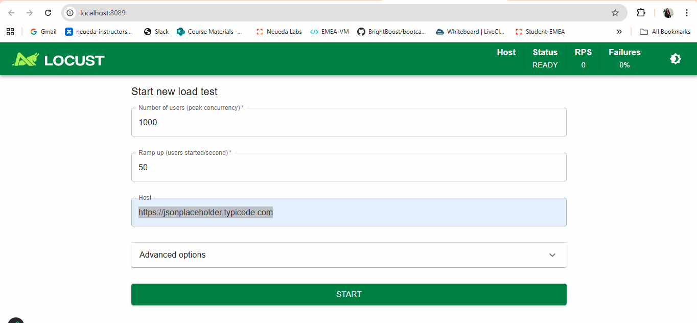
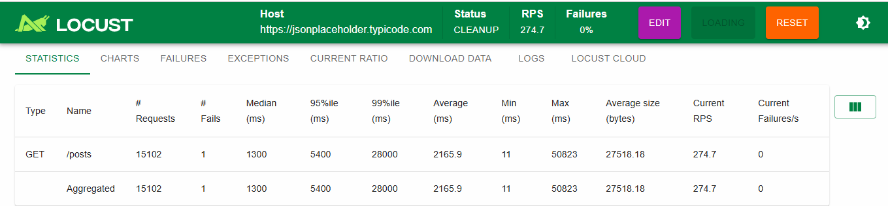
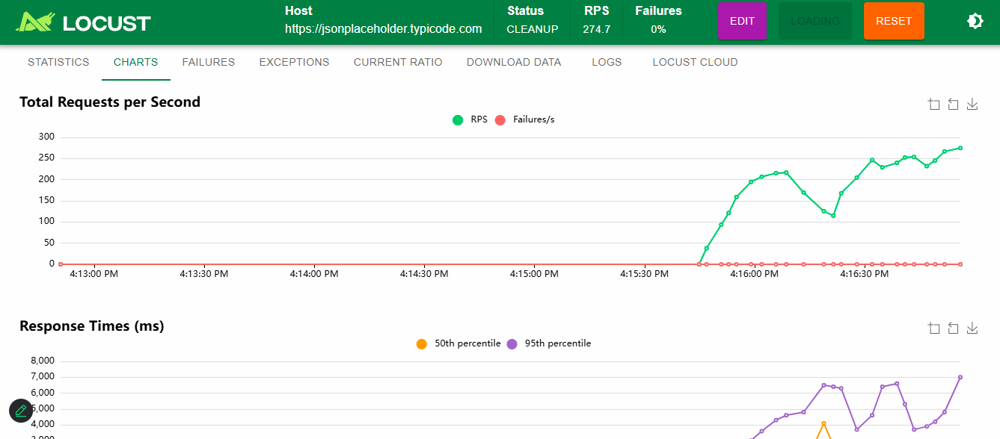
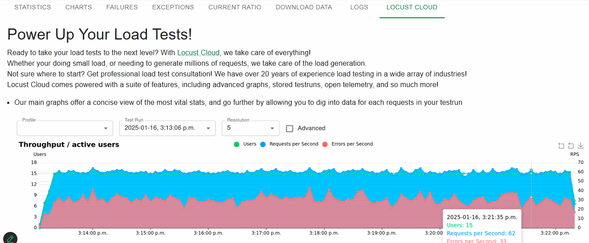

# Stress testing using locust

- Let's Install Locust

```bash
pip install locust 
locust --version # python -m locust --version (use this if direct locust command not working)
```
- create locustfile.py
- use ref code from documentation [Link](https://pypi.org/project/locust/)

```py
from locust import HttpUser, task, between

class MyStressTestUser(HttpUser):
    wait_time = between(1, 2)

    @task
    def get_posts(self):
        self.client.get('/posts')
```
- run command in terminal
```bash
locust -f locustfile.py # python -m locust -f locustfile.py
```
- check the output


- click on submit and check below details


- Check Charts

- Check Locust Cloud


**you can use virtual environment in WSL**
```bash
python3 venv myenv
source myenv/bin/activate
pip install locust
locust --version
locust -f locustfile.py
```