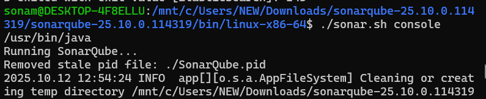
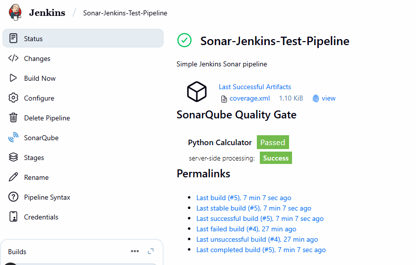

# Follow Below Steps for integration

- make sure your jenkins and Sonar both is running or wither windows or WSL
- if you run sonar on windows and jenkins on WSL your pipeline can fail.

**WSL Execution**

- open wsl -> go to the folder where sonar qube downloaded


- you can use start flag to run in background but
- you can use console to see logs in console

- it will take around 5 minutes to up..

- for wsl make sure you download sonar-scanner for Linux
- keep that also in C:/sonar-scanner-linux folder so you can access
- using /mnt/c/sonar-scanner-linux/bin/sonar-scanner -h
- if this works means scanner is working.

- Now you can set up the jenkins configuration as per the shown file here.

- In jenkins create Pipeline and add below script
```groovy
pipeline {
    agent any

    environment {
        SONARQUBE_ENV = 'MySonar'
    }

    stages {
        stage('Checkout'){
            steps{
                git url:'https://github.com/sonam-niit/python-calculator-sonar.git',branch:'main'
            }
        }
        stage('Create Virtualenv') {
            steps {
                sh '''
                    python3 -m venv venv
                    . venv/bin/activate
                    pip install --upgrade pip
                    pip install -r requirements.txt
                '''
            }
        }

        stage('Run Tests & Coverage') {
            steps {
                sh '''
                    . venv/bin/activate
                    pytest --cov=app --cov-report=xml
                '''
            }
        }

        stage('SonarQube Analysis') {
            steps {
                withSonarQubeEnv("${SONARQUBE_ENV}") {
                    sh '''
                        . venv/bin/activate
                        /mnt/c/sonar-scanner-linux/bin/sonar-scanner
                    '''
                }
            }
        }
    }

    post {
        always {
            archiveArtifacts artifacts: 'coverage.xml', allowEmptyArchive: true
        }
    }
}
```
- click on Build Now



- you can also use my below GitCode copy it make your repo
- try to build directly by selecting JenkinsFile From GitHub

[Git reference](https://github.com/sonam-niit/python-calculator-sonar.git)
- edit your sonarscanner as per requirement
- build it.