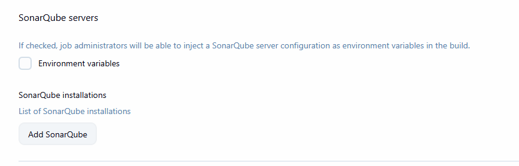
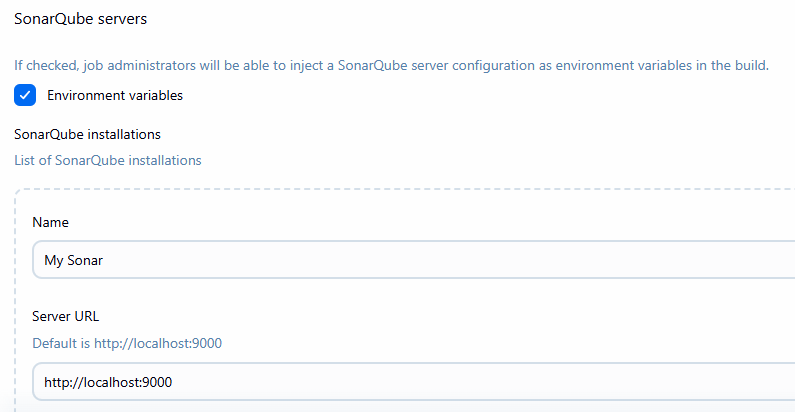
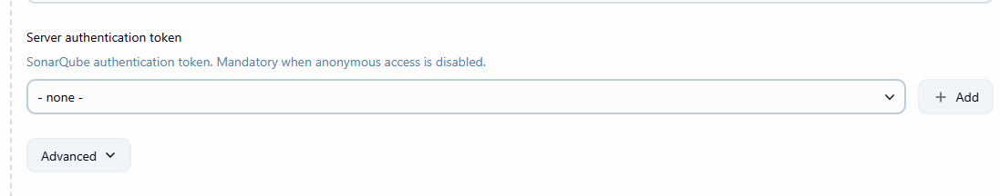
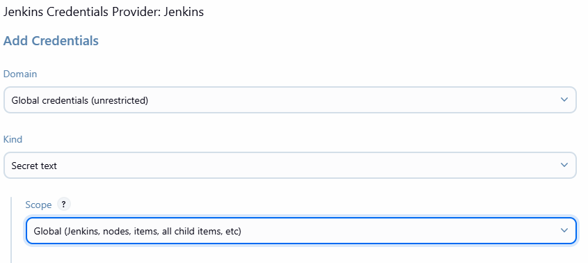
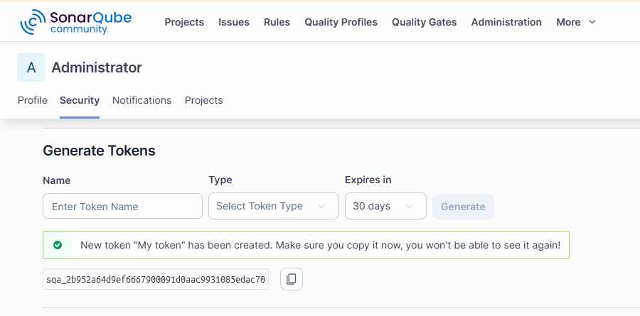
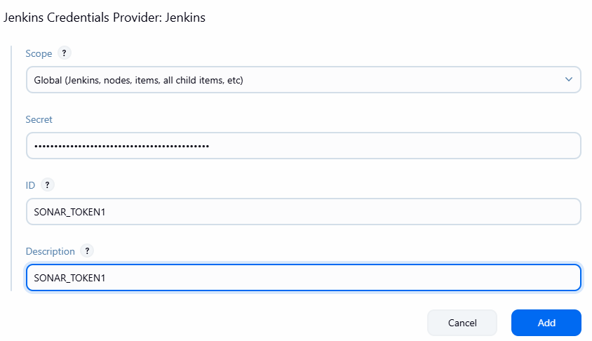

# Sonar Jenkins Integartion

- Open your SonarQube folder and start SorarQube
- Access from localhost:9000, login with changed cred.

- open jenkins, start the service
- access localhost:8080 with cred.

- From Jenkins - click on manage jenkins - plugins
- available plugins - search for SonarQube Scanner
- click on install.

- manage jenkins -> system --> Sonar Qube Servers.

- check on environment  variables
- click on Add Sonar

- you need to add token as secret for that click on add and click on jenkins

- select secret text

- generate token from Sonarqube by clicking profile icon -> MyAccount -> change security tab

- use this token in jenkins
