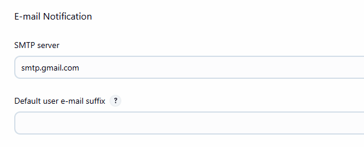
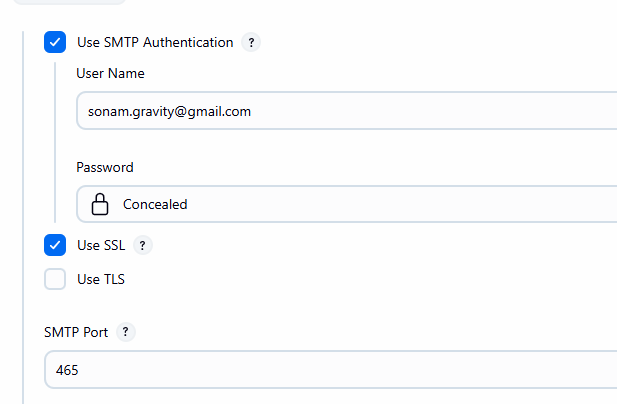
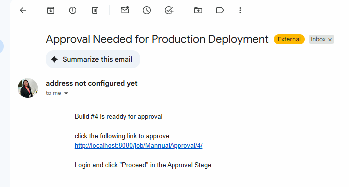

# Create Manual Approvals in Jenkins Pipeline

- create new jenkins Pipeline
- give name, some description
- set up default build values and log rotations.
- in script entered below script for approval.

```groovy
pipeline {
    agent any

    stages {
        stage('Build') {
            steps {
                echo 'This is My Build Stage'
            }
        }
        stage('Test') {
            steps {
                echo 'This is My Test Stage'
            }
        }
        stage('Approval') {
            steps {
                timeout(time:15,unit:'MINUTES'){
                    input message: 'Do you want to approve the Deployment?', ok:'yes'
                }
            }
        }
        stage('Deployment') {
            steps {
                echo 'Application Deployed'
            }
        }
    }
}

```

- save the file
- click on build now.
- check console output and click on yes to deploy, abort to reject.
- check the next execution steps.

## Send an email for Approval pipeline

- you need to configure email Notification
- manage jenkins -> system --> scroll down to Email notification





- Password you can use from Gmail App Password.

- change pipeline code with below mentioned code

```groovy
pipeline {
    agent any

    stages {
        stage('Build') {
            steps {
                echo 'This is My Build Stage'
            }
        }
        stage('Test') {
            steps {
                echo 'This is My Test Stage'
            }
        }
        
        stage('Email for Approval') {
            steps {
                mail to: 'receivers_email_id',
                subject: "Approval Needed for Production Deployment",
                body: """
                Build #${env.BUILD_NUMBER} is readdy for approval
                
                click the following link to approve:
                ${env.BUILD_URL}
                
                Login and click "Proceed" in the Approval Stage
                """
            }
        }
        stage('Approval') {
            steps {
                timeout(time:15,unit:'MINUTES'){
                    input message: 'Do you want to approve the Deployment?', ok:'Approve'
                }
            }
        }
        stage('Deployment') {
            steps {
                echo 'Application Deployed'
            }
        }
    }
}

```

- click on build now


- click on this link, that will redirect you to jenkins Dashboard
- login with credentials 
- click on console Output
- approve or abort
