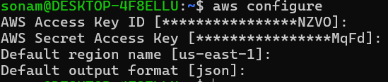

**Note**

- Ansible-playbooks when we are executing its using inventory
- Which is uisng SSH to connect with instance and executes playbook

- If you want to connect with AWS account for creating storage buckets, EC2 instance, databases, Virtual Private Cloud then you need to connect with your account for that in locla system AWS CLI is required to be configured.

# Setup AWS CLI in system to work with ansible terraform

- Why AWS CLI req to be configured?
- to create instance it should know which AWS account
- for that we need secret key and access key
- Which AWS Region: us-east-1
- Which Output format: json, text or table

- When you configure this then it creates 2 files
- ~/.aws/credentials -> stores your keys
- ~/.aws/config -> region and output preferences.


[Documentation Link](https://docs.aws.amazon.com/cli/latest/userguide/getting-started-install.html)

1. For Linux:
```bash
curl "https://awscli.amazonaws.com/awscli-exe-linux-x86_64.zip" -o "awscliv2.zip"
unzip awscliv2.zip
sudo ./aws/install

# above 3 commands will install aws ClI
# Check AWS CLI Version
aws --version
```
## To configure AWS CLI

- Go to AWS Console
- Click on IAM service
- Users 
- create new User-> give name --> next --> attach direct policy 
- select administrator access --> create user
- Click on created user --> right side you can see the option
- create access key
- click on that --> select CLI --> click on checkbox for confirmation
- Give description and click on create key
- Here you can see access key and secret key
- download the CSV file for later reference

- Now again go to linux terminal and run below command

```bash
aws configure
# enter values based on below screenshot
# secret key and access key use yours
```


- After This configuration all ansible commands and terrafor commands works as expected.
- So, now your local system is connected with AWS Console.