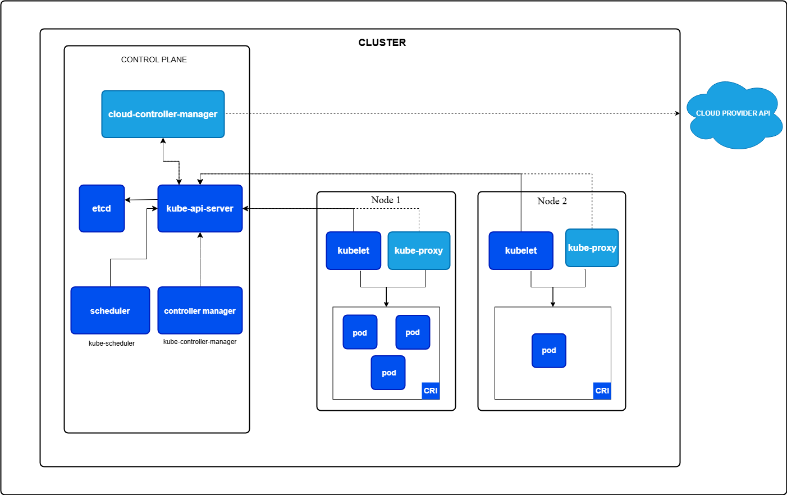

# Kubernetes Intro

- Kubernetes is open source container orchestration platform which is designed to automate deployments, acaling and managing containers.

- manage multiple container between multiple environment possible using k8s.

## Fetaures

- self Healing: auto restart, replace and rescheduling of failed containers
- load balancing: bistribute traffic and provide high availability
- auto scaling
- secret and config management: securing and managing secret data like passwords and API links

## Kuberneters Cluster Architecture



- here you can see cluster having controlplace called master node and other nodes are worker node

1. Master Node: managing cluster and handles all the scheduling, state management and updates
2. worker nodes: Actual application workload running here as pods.
3. Pod: It is a smallest deployable unit where you can run one or more containers.
4. API Server: playing a role as main hub for communication between cluster and users.
5. Controller Manager: managing the state by replication, load balancing..
6. Scheduler: assign pods to nodes based on requirements
7. ETCD: storage for storing cluster data, stored in key value pair.
8. Kubctl/kubelet: 
    - agents which is running on each worker node to maintain container state into its desired state.
    - Its a CLI tool.
    - using that we can interact with kubernetes cluster
9. kube-proxy: managing the networking for all K8s services.

## Docker Swarm

- Docker's native container orchestration tool
- It helps you to run multiple containers across multiple servers(nodes) and manage them as cluster.

- converts multiple host into one cluster
- supposrts scaling service
- manage load balancing
- handle service scheduling
- provides automatic failover

### Comparison

- Docker Swarm: Easy, quick orchestration
- Kuberneters: Powerful, complex orchestration

### Setup Kubectl 

[Reference Link](https://kubernetes.io/docs/tasks/tools/install-kubectl-linux/)

1. Download Latest Release Version
```bash
curl -LO "https://dl.k8s.io/release/$(curl -L -s https://dl.k8s.io/release/stable.txt)/bin/linux/amd64/kubectl"
```
2. Validate Binary file
```bash
curl -LO "https://dl.k8s.io/release/$(curl -L -s https://dl.k8s.io/release/stable.txt)/bin/linux/amd64/kubectl.sha256"
```
3. use checksum you will see OK in the output
```bash
echo "$(cat kubectl.sha256)  kubectl" | sha256sum --check
```
4. Install Kubectl
```bash
sudo install -o root -g root -m 0755 kubectl /usr/local/bin/kubectl
# check version
kubectl version --client
# check detailed view of version
kubectl version --client --output=yaml
```

### Setup a cluster Locally using Minikube

- minikube is local Kubernetes, focusing on making it easy to learn and develop for Kubernetes.

[Download Minikube from Here](https://minikube.sigs.k8s.io/docs/start/?arch=%2Fwindows%2Fx86-64%2Fstable%2F.exe+download)

```bash
curl -LO https://github.com/kubernetes/minikube/releases/latest/download/minikube-linux-amd64
sudo install minikube-linux-amd64 /usr/local/bin/minikube && rm minikube-linux-amd64

minikube version

# start cluster
minikube start

# Check cluster status
minikube status

# Check node details
kubectl get nodes

# Check cluster info
kubectl cluster-info

# access minikube dashboard
minikube dashboard --url

## open url in browser and you can see running services, pods, cluster etc..
```
### Create pods and Service using command

```bash
kubectl run my-pod --image=nginx --port=80
kubect get pods
kubectl describe pod my-pod
# at last see all steps pulling image, starting container etc..
```

### Service
- Expose an application running in your cluster behind a single outward-facing endpoint, even when the workload is split across multiple backends.

```bash
kubectl expose pod my-pod --type=NodePort --port=80
kubectl get svc
# now your service is getting expose
# to access
minikube service my-pod
# see the link provided using localhost:34567
# access that link and you can see default page of nginx

# ctrl+c to exit
## Delete Pod and service

kubectl delete service my-pod
kubectl delete pod my-pod
```

### Create YML files for Pod and service

- running a pod or service using commands is not a good practice
- better to create yml once and use multiple times

- create a file named my-pod.yml
- create a file named my-service.yml

```bash
kubectl apply -f my-pod.yml
kubectl apply -f my-service.yml

## access service
kubectl service my-service
```