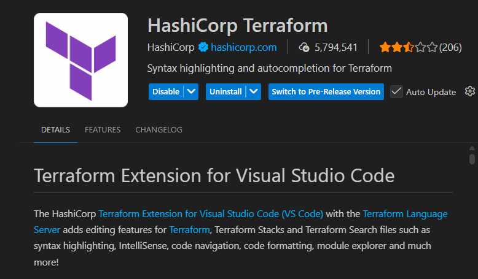

# Terraform

- It is a IaC tool
- which manages all infra in declarative approach using HCL

## Extension for Terraform


## How to install Terraform

[Reference Link](https://developer.hashicorp.com/terraform/tutorials/aws-get-started/install-cli)

- installation on Linux

```bash
# Ensure that your system is up to date and that you have installed the gnupg and software-properties-common packages. 
sudo apt-get update && sudo apt-get install -y gnupg software-properties-common

# Install HashiCorp's GPG key.
wget -O- https://apt.releases.hashicorp.com/gpg | \
gpg --dearmor | \
sudo tee /usr/share/keyrings/hashicorp-archive-keyring.gpg > /dev/null

# Verify the GPG key's fingerprint.
gpg --no-default-keyring \
--keyring /usr/share/keyrings/hashicorp-archive-keyring.gpg \
--fingerprint

# Add the official HashiCorp repository to your system.
echo "deb [arch=$(dpkg --print-architecture) signed-by=/usr/share/keyrings/hashicorp-archive-keyring.gpg] https://apt.releases.hashicorp.com $(grep -oP '(?<=UBUNTU_CODENAME=).*' /etc/os-release || lsb_release -cs) main" | sudo tee /etc/apt/sources.list.d/hashicorp.list

# Update apt to download the package information from the HashiCorp repository.
sudo apt update
# Install Terraform from the new repository.
sudo apt-get install terraform

# verify installation
terraform -version
```

### Configuration files

- files extension is .tf
- written in HCL (Hashicorp Configuration Language)

### Core Components

1. Providers
    - allows terraform to interact with cloud providers like aws, azure, gcp
```tf
    providers "aws" {
        region = "us-east-1"
    }
```
2. Resources:
    - infra component like instance, storage, vpc
```tf
resource "aws_instance" "vm1" {
    ami = "image_id"
    instance_type = "t2.micro"
}
```
3. Variables

    - allowing to set parameters to make code more dynamic
    - we can create seperate file for the variable as well.
```tf
variable instance_type {
    default = "t2.micro"
}

resource "aws_instance" "vm1" {
    ami = "image_id"
    instance_type = var.instance_type
}
```
### Terraform Lifecycle

1. terraform init
2. terraform plan
3. terraform apply
4. terraform destroy 

### Terraform Workflow

1. Write a code ( in terraform)
2. Store it in Version control
3. Review and Test
4. Plan and Apply (show the changes to happen)
5. deploy (CI/CD)

### To work with terraform aws cli must be configured

```bash
aws sts get-caller-identity

aws configure list
```

### Let's create Aws Instance