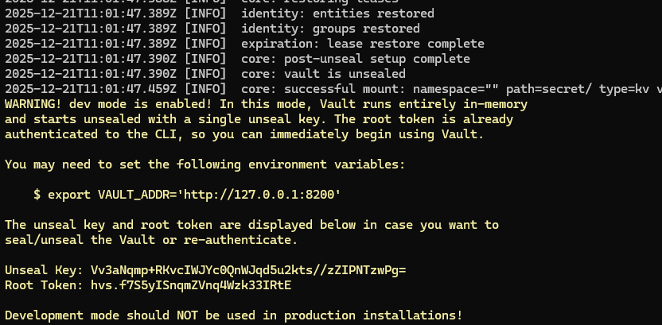

# Vault for Secret Management in Terraform

- Vault is a tool for securely storing and accessing secrets like API keys, DB passwords, SSL certificates, encryption keys 

- for secret management you can also use .env variables
- export AWS_SECRET_KEY=<value>

```tf
provider "aws"{
    access_key = var.AWS_SECRET_KEY
}
```

## Why to use vault instead of .env

- manage leaks (git commit)
- accidently sharing data
- provide centralized access
- secure storage for encryption
- value also supportz dynamic secrets

## Let's use vault locally

- install vault

```bash
sudo snap install vault
vault help 
# start vault server
vault server -dev
# it will start server
# open another wsl to work with vault secrets
```

- from this copy the export command and run in another terminal

```bash
export VAULT_ADDR='http://127.0.0.1:8200'
export VAULT_TOKEN='<copy your root token here>'

# create and enable KV (key value pair at path /secret)
vault secrets enable --path=secret kv
#create secret
vault kv put secret/db-pass password="your_password"
#try to access secret
vault kv get secret/db-pass

## If you don't want to use export variables then use
vault login
# enter root token
# you will be successfully authenticated
vault kv put secret/cred username="admin" password="admin123"
vault kv get -format=json secret/cred
```
- to access them directly in terraform

- create main.tf file
- create outputs.tf file as shown here

- just mention provider vault only address and token will be detected automatically
- you can access data based on keys as well