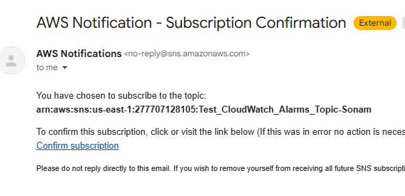
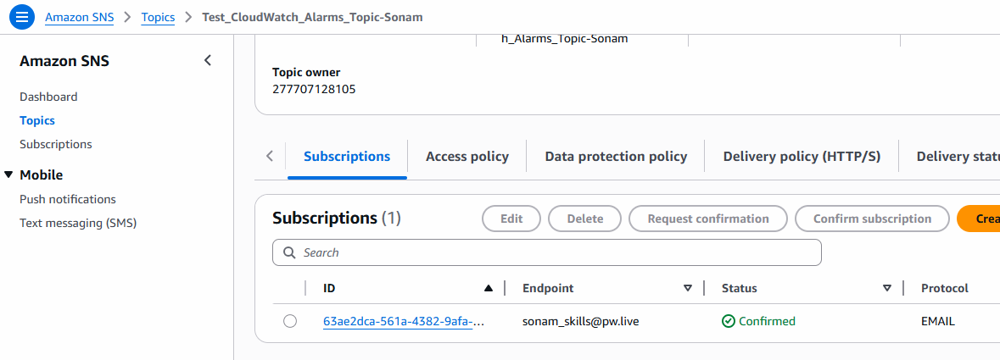
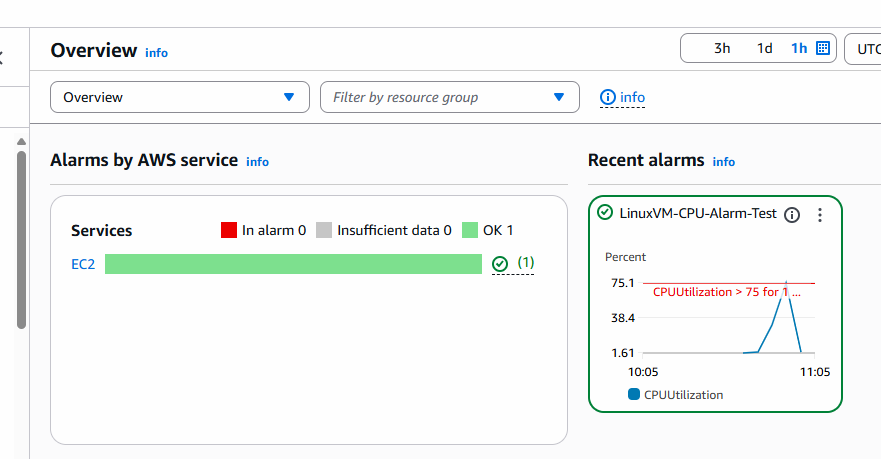
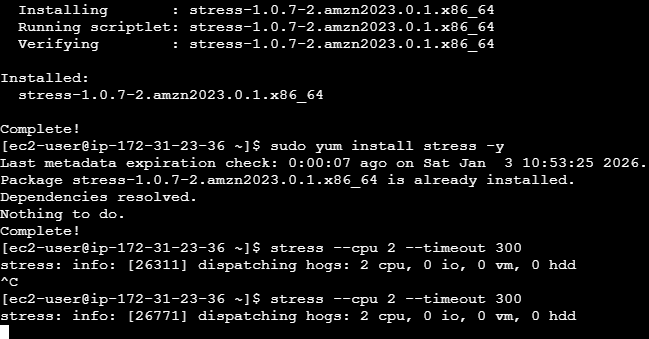
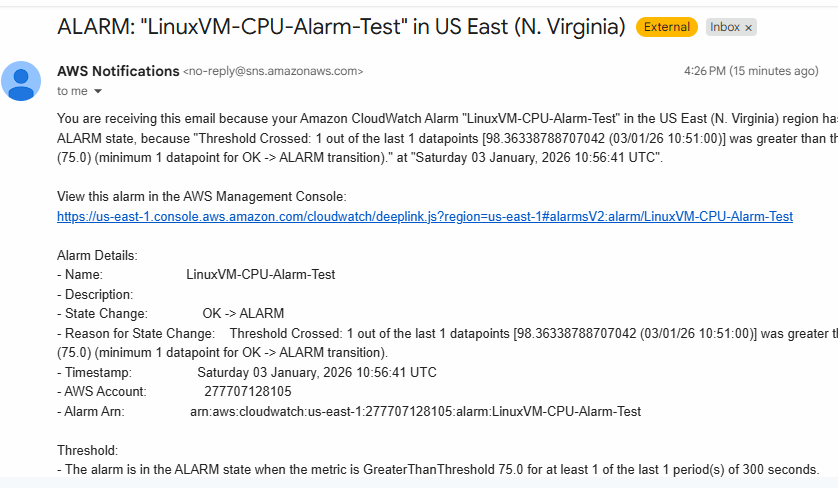

# Create Cloud Watch Alarm

- Login to your AWS Console

- EC2 Dashboard
- Create One Linux VM 

- Search For CloudWatch
- Click on that --> Navigate to Alarms --> All Alarms --> Create Alarm
- Choose Metric --> Browser --> EC2 Click --> Per Instance Metrics --> Select 
- EC2 Instance Which you have created with CPU Utilization

- Incase Not able to See instance Name then search With Instance ID
- Click Select Metrics

- Define Condition
- CPU Utilization (By Default Unit is Percentage)
- Stastics --> Average

- Give Condition
- Greater than or Equal 75

*Alarm will triggere if the CPU usage >= 75%*

- Click Next
- Confirm SNS (Which is for Email Notification)

- Click on create Topic
- give name , enter your email Id

- Check in your email--> you must have received an email for subscription
- confirm the same


- You can check its confirmed or not from SNS service in AWS



- click on next, give alarm name and create Alarm

- Check Cloud Watch Dashboard


## Increase Stress on EC2 instance to trigger an Alarm

- connect with instance
- you can directly connect from browser as well.

```bash
sudo yum install stress -y

stress --cpu 2 --timeout 300
# Runs 2 CPU workers for 5 Minutes
```


- Now Again Check Cloudwatch Dashboard you Can see
- Status changed from OK(1) to In Alarm(1)
- Also, check your email for Alarm Trigger



